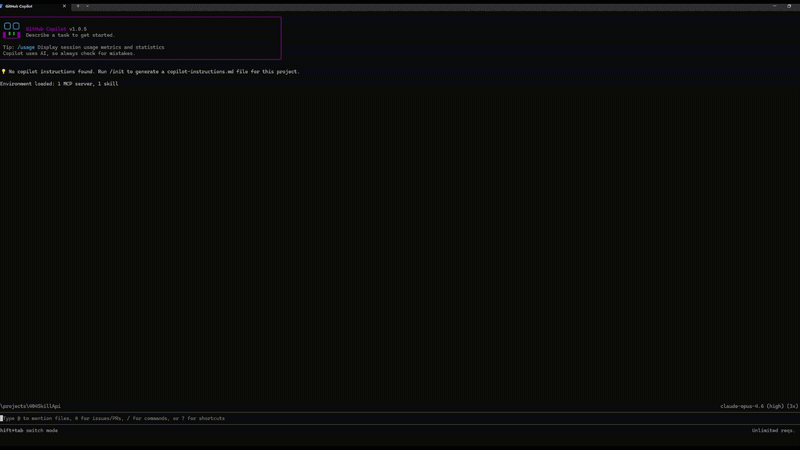
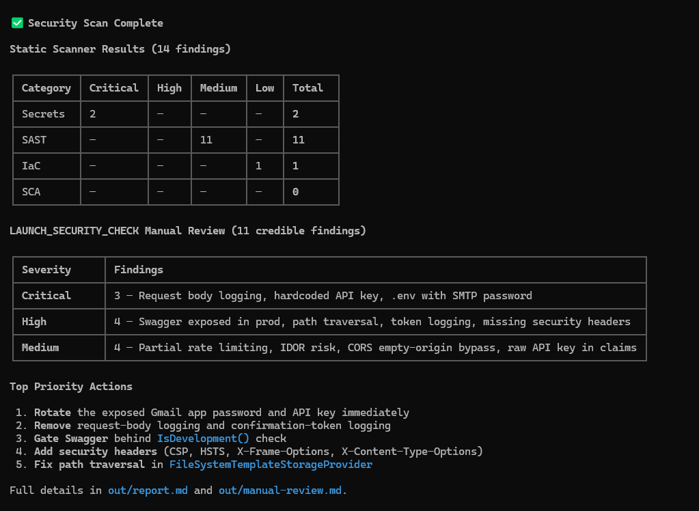

# code-security-skills



## Example Report

#file:report.png



## Skill Included

- `security-scan`: full static security scan (secrets + SAST + SCA + IaC) plus `LAUNCH_SECURITY_CHECK` for high-risk behavioral/architectural gaps.

## Canonical Source

This repo keeps the canonical skill at:

- `.github/skills/security-scan/`

Use the sections below to place the same skill in each agent's discovery path.

## GitHub Copilot

### Setup

Project-level (already valid in this repo):

- `.github/skills/security-scan/`

Copilot also supports:

- Project: `.claude/skills/security-scan/`
- Personal: `~/.copilot/skills/security-scan/` or `~/.claude/skills/security-scan/`

Optional copy examples:

```bash
mkdir -p ~/.copilot/skills
cp -R .github/skills/security-scan ~/.copilot/skills/security-scan
```

```powershell
New-Item -ItemType Directory -Force $HOME/.copilot/skills | Out-Null
Copy-Item -Recurse -Force .github/skills/security-scan $HOME/.copilot/skills/security-scan
```

### Use

- Prompt naturally (Copilot will auto-select matching skills), for example:
- "Run a full security scan."
- "Run LAUNCH_SECURITY_CHECK and prioritize account-takeover risks."

## OpenAI Codex

### Setup

Codex loads personal skills from `$CODEX_HOME/skills` (commonly `~/.codex/skills`).
Many Codex setups also support project skills from `.agents/skills`.

Project-level:

```bash
mkdir -p .agents/skills
cp -R .github/skills/security-scan .agents/skills/security-scan
```

```powershell
New-Item -ItemType Directory -Force .agents/skills | Out-Null
Copy-Item -Recurse -Force .github/skills/security-scan .agents/skills/security-scan
```

Personal:

```bash
CODEX_HOME="${CODEX_HOME:-$HOME/.codex}"
mkdir -p "$CODEX_HOME/skills"
cp -R .github/skills/security-scan "$CODEX_HOME/skills/security-scan"
```

```powershell
$codexHome = if ($env:CODEX_HOME) { $env:CODEX_HOME } else { "$HOME/.codex" }
New-Item -ItemType Directory -Force "$codexHome/skills" | Out-Null
Copy-Item -Recurse -Force .github/skills/security-scan "$codexHome/skills/security-scan"
```

### Use

- Run `/skills` to confirm discovery.
- Invoke directly: `$security-scan Run LAUNCH_SECURITY_CHECK and summarize critical findings.`
- Or ask naturally and let Codex trigger it implicitly.

## Claude Code

### Setup

Project-level:

```bash
mkdir -p .claude/skills
cp -R .github/skills/security-scan .claude/skills/security-scan
```

```powershell
New-Item -ItemType Directory -Force .claude/skills | Out-Null
Copy-Item -Recurse -Force .github/skills/security-scan .claude/skills/security-scan
```

Personal:

```bash
mkdir -p ~/.claude/skills
cp -R .github/skills/security-scan ~/.claude/skills/security-scan
```

```powershell
New-Item -ItemType Directory -Force $HOME/.claude/skills | Out-Null
Copy-Item -Recurse -Force .github/skills/security-scan $HOME/.claude/skills/security-scan
```

### Use

- Invoke directly: `/security-scan`
- Or prompt naturally, for example:
- "Run a comprehensive security scan and include LAUNCH_SECURITY_CHECK findings."

## Reference

- `.github/skills/security-scan/SKILL.md`

## Official Docs

- GitHub Copilot skills: `https://docs.github.com/en/copilot/how-tos/use-copilot-agents/coding-agent/create-skills`
- OpenAI Codex skills: `https://developers.openai.com/codex/skills`
- Claude Code skills: `https://docs.claude.com/en/docs/claude-code/skills`
